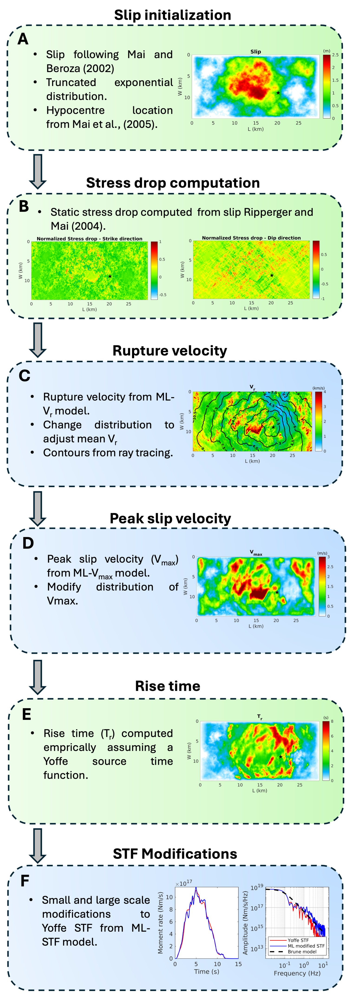

# Machine learning based rupture generator

This repository contains code for Machine learning based rupture generator (MLRG)

## Features
- Generate a slip realization for given dimensions of fault following Mai and Beroza (2002)
- Hypocenter location can be specified manually or using Mai et al., (2005)
- Computes kinematic source parameters such as onset times, rise times, peak slip velocities.
- Allows for source time functions (STFs) to be Yoffe or modified Yoffe using Machine learning.

## Usage
- Clone the repository using git clone
- Install pytorch from https://pytorch.org/get-started/locally/
- Install few more dependencies
	- pip install monai
	- pip install scipy
	- pip install scikit-fmm
	- pip install matplotlib
- Use script gen_PD_source.ipynb to list all input parameters and generate source models

## Acknowledgements

- Some Python codes have been adopted from the following sources http://equake-rc.info/cers-software/
- The fast marching code is adopted from https://github.com/scikit-fmm/scikit-fmm/tree/master

## References

[1] Aquib, T. A., J. C. Vyas, and P. M. Mai (2025). Pseudo-Dynamic Source Characterization for Geometrically Rough Faults Using Machine Learning, Bull. Seismol. Soc. Am. 115, 1570–1590, doi: 10.1785/0120240237

## Cite the code

